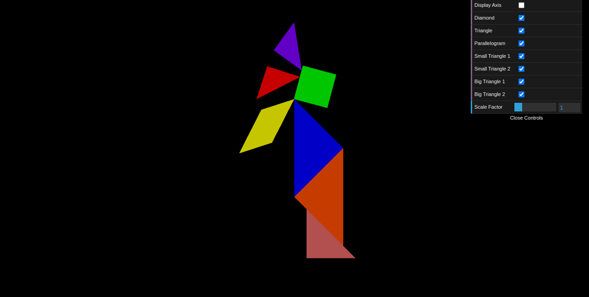
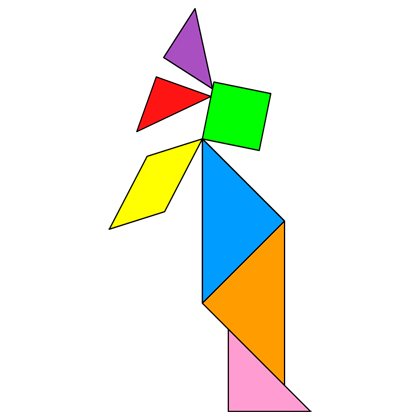
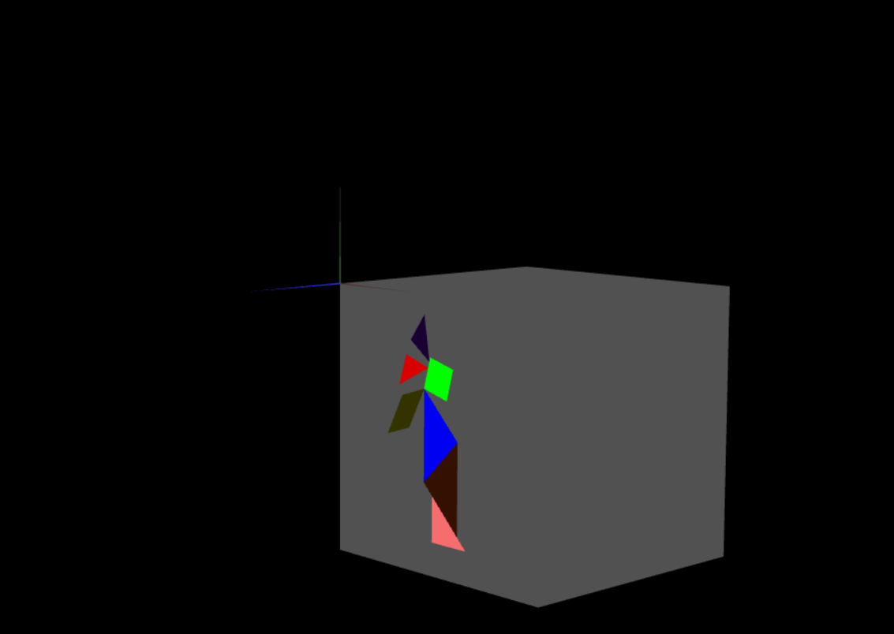
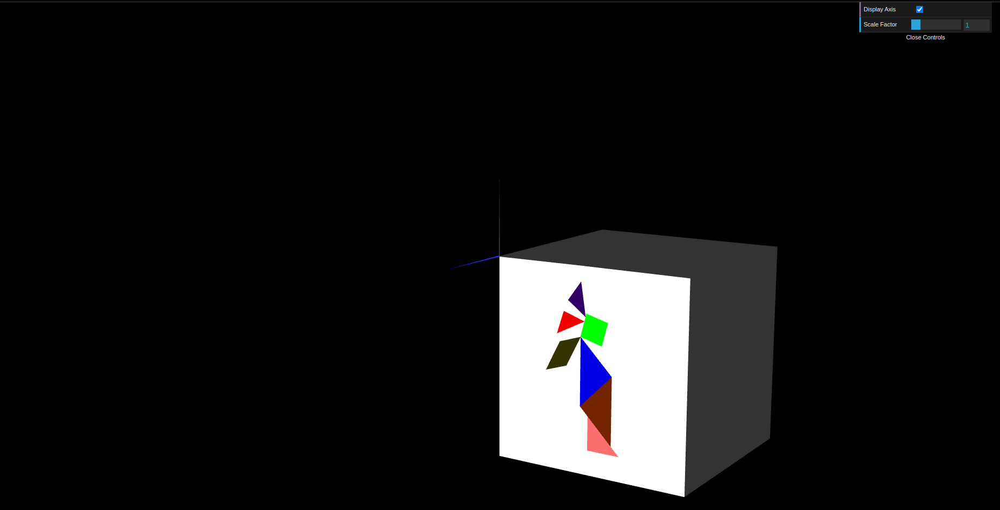

# CG 2023/2024

## Group T11G05

## TP 2 Notes

- In exercise 1, we found dificulty in placing the objects in the correct place and angle.

|   |   |
|---|---|
| Figure 1: Tangram  | Figure 2: Requested Tangram  |

- In exercise 2, it started to get easier after understanding how the vertices worked. After that, we were able to create the cube. The hardest part was understanding how to move the cube and the tangram. What we decided to do was to create a compostion of the tangram and the cube, and then move the composition to the correct place.

  
Figure 3: Cube and Tangram 

- Exercise 3 was easy since, at this point, we had already gotten the hang of 3d object transformations and how to use them.

  
Figure 4: QuadCube and Tangram 