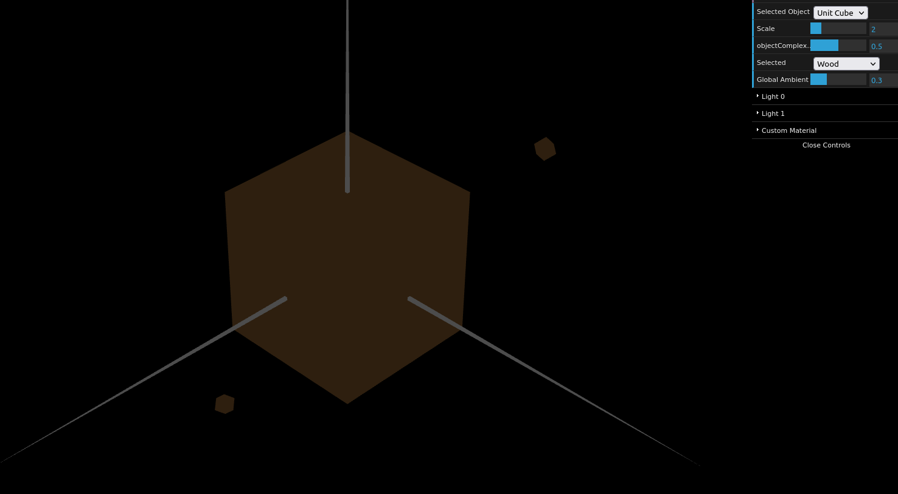
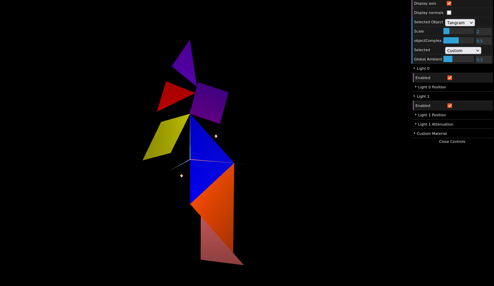
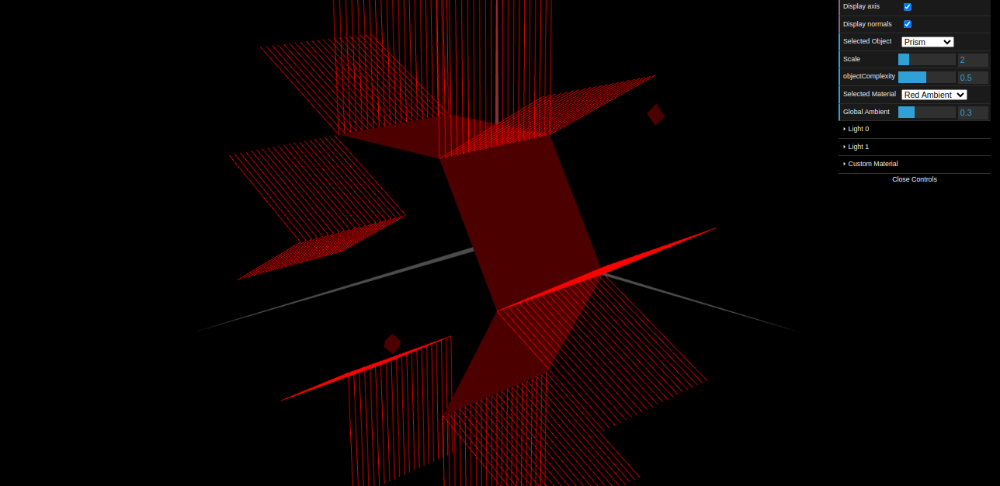
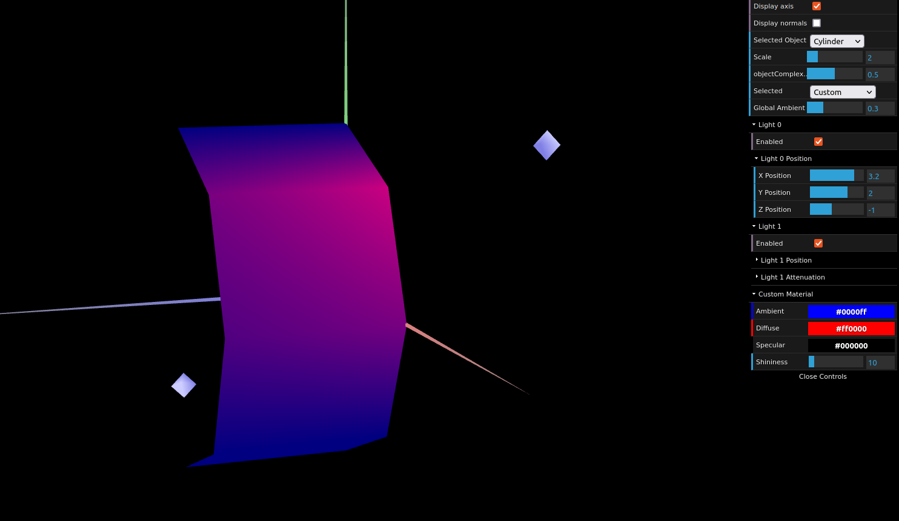

# CG 2023/2024

## Group T11G05

## TP 3 Notes

- In exercise 1, we found some difficulties with setting the normals for each vertice. After that, we were able to do it smoothly.

Figure 1: Wood Unit Cube
 

Figure 2: Tangram with custom colour

- In exercise 2, we found some difficulties finding the angle for the normals. Also, when we had to add the stacks to the prism, we had some problems finding a way to declare the indices.

Figure 3: Prism with 6 slices and 20 stacks 
 

- In exercise 3, we found some difficulties in changing the indices from the prism. We found the rest of the task not hard.  

Figure 4: Cylinder with 8 slices and 20 stacks 
 