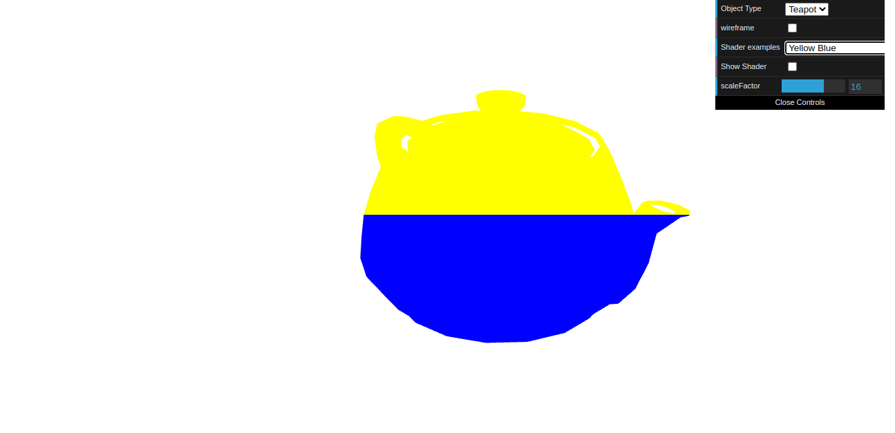
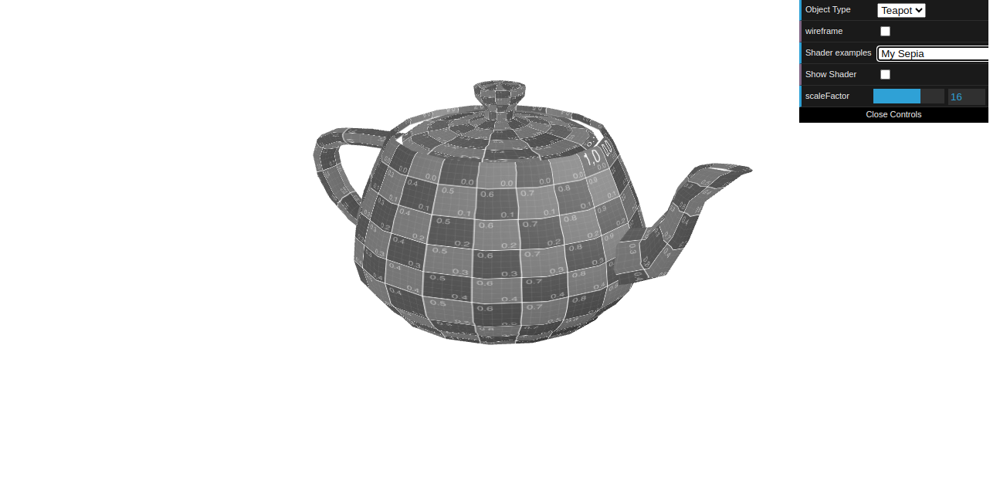
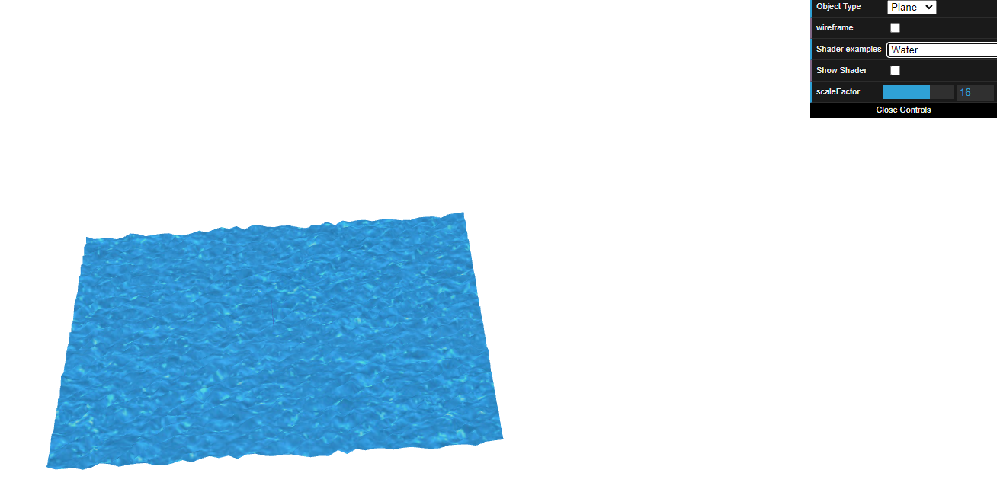

# CG 2023/2024

## Group T11G05

## TP 5 Notes

- In exercise 1 we had alot of difficulty understanding shaders in general and how to work with variables across the vertex and the shader files but we managed to do it.

Figure 1: Blue Yellow Bule

Figure 2: My Sepia

- In exercise 2 we had to create a shader that would apply water texture and water map to a plane. We found some difficulties as we were not able to do the texture mapping for high values of the texture coordinates.

Figure 3: Water Plane